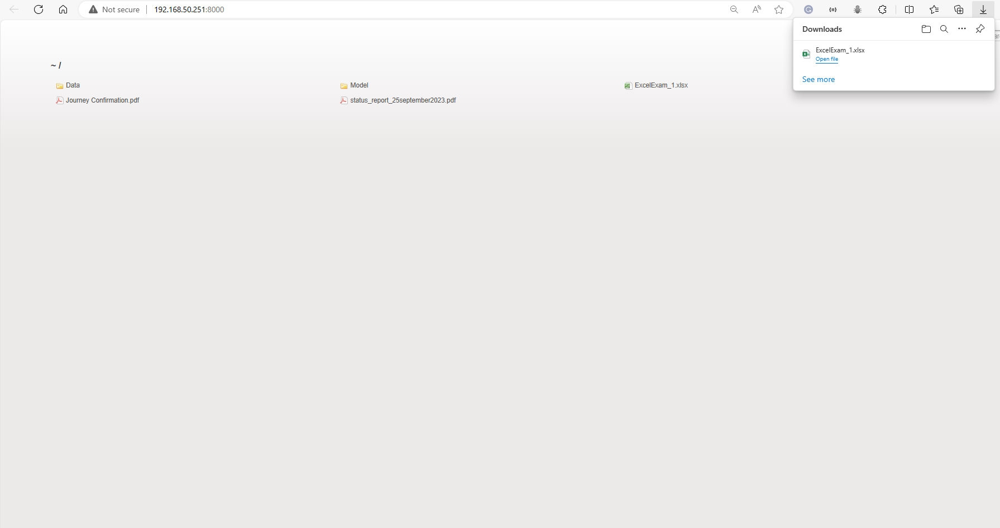

# My Custom File Server

This is a basic file server built with Node.js and Express, designed to serve files from a specified directory over a local network. It provides a web interface for easy file access and browsing.


## Screen Shot




## Features

- Easily serve files from a specific directory over your local network.
- User-friendly web interface for file browsing.
- Support for directory listing with icons.

## Prerequisites

Before you begin, ensure you have met the following requirements:

- Node.js and npm installed on your system.
- The `express` and `serve-index` npm packages installed.

## Installation

1. Clone or download this repository to your local machine.
2. Open a terminal and navigate to the project directory.

   ```shell
   cd path/to/your/project
   ```

3. Install the required packages:

   ```shell
   npm install
   ```

## Usage

1. Edit the `public` directory in your project to contain the files you want to serve.

2. Start the file server:

   ```shell
   node server.js
   ```

3. The server will start and print the URL where you can access the file server, typically `http://localhost:8000`.

4. Open a web browser and access the URL. You will see a user-friendly interface for browsing and downloading files from the `public` directory.

## Configuration

You can customize the server by modifying the `server.js` file:

- Change the `port` variable to set a different port for the server.
- Adjust the `serverIndex` options to customize the appearance and behavior of the directory listing.

## Support and Issues

If you encounter any issues or have questions, please feel free to [open an issue](https://github.com/your-username/your-file-server/issues) in the GitHub repository.

## License

This project is licensed under the MIT License - see the [LICENSE](LICENSE) file for details.

## Acknowledgments

This project was built using Node.js and Express.

